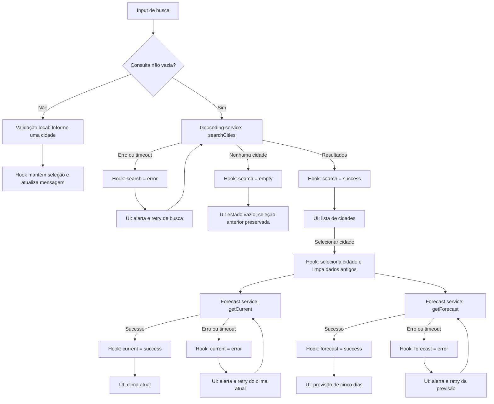

# Plano Técnico — Weather App

Este plano deriva de `specs/weather-app-spec.md`. Define arquitetura e contratos para a v1; não é implementação. A especificação é a fonte da verdade em caso de divergência.

## Architecture

SPA em React com fluxo unidirecional e camadas pequenas:

- **Apresentação (`components/`)**: busca, seleção, clima e previsão; recebe valores e callbacks por props, renderiza os estados acessíveis e não chama APIs nem mantém estado de domínio.
- **Orquestração/estado (`hooks/`)**: `useWeather` coordena seleção, unidade, loading/erro/vazio por consulta, retentativas e descarte de respostas obsoletas; não contém markup nem detalhes do JSON externo.
- **Acesso a dados (`services/`)**: `weatherService` encapsula URLs, `fetch`, timeout, validação da resposta e mapeamento para os tipos internos; não depende de React.
- **Funções puras (`lib/`)**: conversão/arredondamento de temperatura, códigos WMO, normalização de busca e formatação de datas; sem I/O ou estado, portanto determinísticas para uma mesma entrada.
- **Contratos (`types/`)**: tipos compartilhados entre camadas; não importam componentes, hooks ou serviços.

Direção das dependências: componentes chamam o hook; o hook coordena os serviços; serviços normalizam as respostas. Qualquer camada pode importar `types`, e componentes/hooks podem usar helpers puros de `lib` sem depender de `services`. `lib` não depende de React nem de I/O. `App.tsx` apenas compõe a tela e conecta o hook aos componentes. Uma seleção dispara as consultas de clima atual e previsão em paralelo. Elas mantêm estados e retentativas independentes; uma falha não apaga o sucesso da outra. Cada resultado é associado à cidade da solicitação. Ao selecionar outra cidade, os dados meteorológicos anteriores deixam de ser exibidos; respostas atrasadas da seleção anterior são ignoradas.

Essa separação permite testar regras de `lib` como funções unitárias, `services` com `fetch` controlado sem renderizar React, transições/retries do hook com respostas de serviço simuladas e componentes com Testing Library focada em conteúdo acessível e interação. O E2E fica restrito aos fluxos integrados principais.

## Tech Stack

| Área | Decisão | Motivo |
| --- | --- | --- |
| Linguagem | TypeScript strict | Contratos explícitos e verificação estática. |
| Interface | React 19 + Vite | Stack existente e adequada para uma SPA sem servidor próprio. |
| Estilo | Tailwind CSS | Já definido pelo projeto; atende à implementação responsiva. |
| Requisições | `fetch`, `AbortController` | API nativa suficiente para poucos endpoints, timeout e cancelamento. |
| Testes unitários | Vitest + Testing Library | Stack existente para funções, serviços e estados visíveis da UI. |
| Testes E2E | Playwright | Stack existente para fluxos completos, teclado e viewports. |
| Dados | Open-Meteo | Fonte definida pela spec; sem chave de API para esta v1. |

Não adicionar biblioteca de estado, cliente HTTP, roteador ou camada de cache: o escopo é uma tela e os recursos nativos atendem aos contratos.

## Project Structure

```text
src/
├── components/
│   ├── SearchBar.tsx       # entrada e submissão da busca
│   ├── CityResults.tsx     # resultados e seleção explícita
│   ├── CurrentWeather.tsx  # clima atual e estados da seção
│   ├── ForecastList.tsx    # cinco dias e estados da seção
│   └── UnitToggle.tsx      # seleção acessível de unidade
├── hooks/
│   └── useWeather.ts       # estado e orquestração da tela
├── services/
│   └── weatherService.ts  # Open-Meteo, timeout e normalização
├── lib/
│   ├── citySearch.ts       # trim e Unicode NFC
│   ├── temperature.ts     # conversão e arredondamento C/F
│   ├── weatherCodes.ts    # código WMO para condição pt-BR
│   └── dateTime.ts        # datas civis e horários por fuso
├── types/
│   └── weather.ts          # contratos compartilhados
└── App.tsx                 # composição da tela

tests/
├── unit/       # lib e services; regras testadas sem UI/rede real
├── hooks/      # orquestração, estados independentes e retentativas
├── components/ # renderização, acessibilidade e interações
└── e2e/        # fluxos integrados principais com Playwright
```

Manter um componente por arquivo. Os estados de carregamento, vazio e erro pertencem à seção correspondente e podem ser renderizados por seus componentes, sem uma abstração global de estado. Os testes acompanham as fronteiras de responsabilidade: mocks nos limites de serviço/hook e nenhuma chamada real à Open-Meteo em testes automatizados.

## Data Model

Os contratos abaixo são o modelo normalizado pretendido, baseado nos campos retornados pela Open-Meteo. Dados opcionais ou ausentes tornam-se `null` em vez de valores fabricados. `WeatherData` representa o conjunto associado à cidade; a UI ainda mantém estados de carregamento/erro independentes para clima atual e previsão.

```ts
export type Unit = 'celsius' | 'fahrenheit';

export interface City {
  id: number | null; // identificador Open-Meteo, quando fornecido
  name: string; // nome da localidade retornado pela geocodificação
  admin1: string | null; // região ou estado, quando disponível
  country: string | null; // país, quando disponível
  latitude: number; // latitude usada nas consultas meteorológicas
  longitude: number; // longitude usada nas consultas meteorológicas
}

export type QueryState<T> =
  | { status: 'idle' | 'loading' }
  | { status: 'empty' }
  | { status: 'success'; data: T }
  | { status: 'error'; error: QueryError };

export interface QueryError {
  kind: 'timeout' | 'network' | 'http' | 'api' | 'invalid-response';
  message: string;
}

export interface CurrentWeather {
  temperatureC: number | null; // temperature_2m, normalizada para Celsius
  weatherCode: number | null; // weather_code, mapeado para rótulo na apresentação
  observedAt: string | null; // current.time normalizado para instante ISO
}

export interface ForecastDay {
  date: string; // daily.time como data civil local YYYY-MM-DD
  weatherCode: number | null; // daily.weather_code
  minTemperatureC: number | null; // daily.temperature_2m_min, em Celsius
  maxTemperatureC: number | null; // daily.temperature_2m_max, em Celsius
  precipitationProbability: number | null; // daily.precipitation_probability_max, em %
}

export interface WeatherData {
  city: City; // cidade selecionada à qual os dados pertencem
  timeZone: string; // timezone da API ou 'UTC' quando ausente/inválido
  current: CurrentWeather; // observação atual normalizada
  forecast: ForecastDay[]; // hoje e os quatro dias seguintes, em ordem local
}

export interface WeatherLocation {
  city: City; // resultado de geocodificação selecionado
  timeZone: string; // fuso IANA conhecido ou 'UTC' até a resposta meteorológica
}
```

`QueryState<T>` é aplicado separadamente à busca (`City[]`), ao clima atual (`CurrentWeather`) e à previsão (`ForecastDay[]`). `WeatherData` é o formato agregado após normalização; a seleção em carregamento permanece `City` até o fuso ser conhecido e pode ser mantida em `WeatherLocation` (`city` + `timeZone`) no estado da tela. Um campo ausente em resposta válida permanece `null`; uma data sem entrada da fonte é representada com seus campos meteorológicos nulos, sem copiar valores de outro dia. `isStale` é derivado comparando `observedAt` ao relógio atual, não armazenado no contrato.

As temperaturas normalizadas são sempre Celsius. A unidade selecionada só altera a apresentação: Fahrenheit usa $F = C \times 9/5 + 32$; arredondar para inteiro com empates afastando-se de zero. Códigos WMO são mapeados para rótulos em pt-BR; códigos desconhecidos resultam em condição indisponível.

## Data Flow



Em detalhe: submissões vazias são bloqueadas antes do serviço; a busca normaliza espaços externos e Unicode NFC sem remover acentos. Resultados identificam cidade, região e país quando disponíveis. Selecionar um resultado inicia chamadas paralelas; cada conclusão só atualiza o estado se ainda corresponder à seleção atual. Alternar unidade não refaz chamadas. Falhas preservam a cidade selecionada e permitem repetir apenas a seção afetada.

## External APIs

Todas as chamadas usam HTTPS, `fetch` com `AbortController` e limite total de 10 segundos. O serviço verifica `response.ok`, valida a estrutura mínima e mapeia a resposta externa para os tipos internos. Não persistir texto de busca nem dados da sessão.

**Geocoding**

```text
GET https://geocoding-api.open-meteo.com/v1/search
  ?name={consulta NFC e sem espaços externos}
  &count=10
  &language=pt
  &format=json
```

Exemplo resumido de sucesso:

```json
{
  "results": [
    {
      "id": 3448439,
      "name": "São Paulo",
      "latitude": -23.55,
      "longitude": -46.63,
      "admin1": "São Paulo",
      "country": "Brasil"
    }
  ]
}
```

Mapeamento: cada item de `results[]` vira um `City` (`id`, `name`, `admin1`, `country`, `latitude`, `longitude`); campos opcionais ausentes viram `null`. Preservar caracteres recebidos. Uma resposta válida sem resultados é busca vazia, não erro.

**Forecast — clima atual (`current`)**

```text
GET https://api.open-meteo.com/v1/forecast
  ?latitude={latitude}&longitude={longitude}
  &current=temperature_2m,weather_code
  &timezone=auto
```

Resposta resumida:

```json
{
  "latitude": -23.55,
  "longitude": -46.63,
  "timezone": "America/Sao_Paulo",
  "utc_offset_seconds": -10800,
  "current": {
    "time": "2026-09-30T14:30",
    "temperature_2m": 18.2,
    "weather_code": 3
  }
}
```

Mapeamento: `current.temperature_2m` vira `CurrentWeather.temperatureC`; `current.weather_code` vira `weatherCode`; `current.time`, interpretado com `utc_offset_seconds`, é normalizado para `observedAt` ISO. Os metadados `timezone` e `utc_offset_seconds` são usados para `WeatherData.timeZone` e para formatar/avaliar horários. Campo meteorológico ausente ou inválido vira `null`.

**Forecast — previsão diária (`daily`)**

```text
GET https://api.open-meteo.com/v1/forecast
  ?latitude={latitude}&longitude={longitude}
  &daily=weather_code,temperature_2m_min,temperature_2m_max,precipitation_probability_max
  &forecast_days=5
  &timezone=auto
```

Resposta resumida (os arrays reais têm cinco posições):

```json
{
  "timezone": "America/Sao_Paulo",
  "daily": {
    "time": ["2026-09-30", "2026-10-01"],
    "weather_code": [3, 61],
    "temperature_2m_min": [12.0, 13.0],
    "temperature_2m_max": [20.0, 21.0],
    "precipitation_probability_max": [40, 65]
  }
}
```

Mapeamento: combinar os arrays de `daily` pelo mesmo índice para criar `ForecastDay[]`: `time` → `date`, `weather_code` → `weatherCode`, `temperature_2m_min/max` → `minTemperatureC`/`maxTemperatureC` e `precipitation_probability_max` → `precipitationProbability`. Valores ausentes/inválidos viram `null`; tratar as datas como datas civis locais, sem conversão implícita por `Date`. A resposta diária fornece `timezone` para `WeatherData.timeZone`.

As duas chamadas usam o mesmo endpoint Forecast, mas são separadas para permitir estados e retentativas independentes de clima atual e previsão (RF6), ao custo de duas requisições meteorológicas por cidade selecionada. `timezone=auto` solicita o fuso da coordenada; usar os valores padrão Celsius da API. Comparar `observedAt` com o relógio atual para derivar `isStale`. Preservar hoje e os quatro dias seguintes no fuso retornado; se uma data estiver ausente, criar sua entrada com campos meteorológicos nulos, sem copiar valores. Se `timezone` estiver ausente ou inválido, aplicar UTC e identificá-lo na UI.

Os nomes de variáveis e parâmetros devem ser confirmados contra a versão vigente da documentação Open-Meteo durante a implementação. Licença, atribuição, limites, cobertura e política aplicável são gates de lançamento definidos na spec.

## State Management

Um hook `useWeather` no nível de `App` é a única fonte do estado da tela durante a sessão; dados descem por props e ações sobem por callbacks. Não usar persistência local ou remota. Busca, clima atual e previsão têm ciclos de vida independentes com os estados explícitos `idle`, `loading`, `success`, `error` e `empty`:

- `idle`: nenhuma busca foi enviada ou ainda não há cidade selecionada para consultar.
- `loading`: a consulta correspondente está em andamento.
- `success`: há resultados de busca ou dados meteorológicos normalizados.
- `empty`: somente a geocodificação terminou com sucesso e não encontrou cidades; não é erro nem estado para consulta meteorológica.
- `error`: rede, API, timeout ou resposta inválida impediu a consulta de produzir resultado utilizável.

```ts
interface WeatherViewState {
  searchQuery: string;
  searchValidation: string | null;
  search: QueryState<City[]>;
  selectedLocation: WeatherLocation | null;
  current: QueryState<CurrentWeather>;
  forecast: QueryState<ForecastDay[]>;
  unit: Unit;
}
```

Inicializar `search` em `idle`, `searchValidation` em `null`, consultas de clima em `idle`, cidade em `null` e `unit` em `celsius`. `searchQuery` e a unidade existem apenas em memória e não são restauradas após recarregar. Submissão vazia não chama a API, mantém `search` como está e define `searchValidation` como `Informe uma cidade`. Busca válida limpa essa mensagem; resultado sem correspondências define `search` como `empty` e remove resultados anteriores sem apagar a cidade/clima já selecionados.

Ao selecionar uma cidade, limpar os dados de clima da seleção anterior e iniciar `current` e `forecast` em `loading`, em paralelo. Cada uma pode terminar em `success` ou `error` independentemente; a retentativa muda apenas a consulta afetada. Cancelar requests antigos quando possível e ignorar respostas que não pertençam à seleção ativa.

Armazenar temperaturas normalizadas em Celsius. Durante a renderização, derivar cada valor exibido com uma função pura `convertTemperature(valueC, unit)`: para Fahrenheit, aplicar $F = C \times 9/5 + 32$; arredondar para inteiro com empates afastando-se de zero, como exige RF4. A troca de `unit` apenas atualiza estado local e re-renderiza; não altera dados, datas, condições ou precipitação, e nunca dispara request. Celsius é o padrão de cada nova sessão.

## Error Handling

- **Rede:** falha de conexão/requisição vira `error` com `kind: 'network'`; encerrar loading e oferecer retry para a consulta identificada.
- **HTTP/API:** resposta HTTP não bem-sucedida vira `kind: 'http'`; erro declarado no payload da Open-Meteo vira `kind: 'api'`. Não interpretar nenhuma delas como resultado vazio ou dado meteorológico.
- **Timeout:** após 10 segundos, abortar a operação e produzir `kind: 'timeout'`. Distinguir timeout de cancelamento intencional por troca de cidade; cancelamentos obsoletos não geram alerta.
- **Resposta inválida:** JSON ilegível, estrutura incompatível ou ausência de dados utilizáveis para a seção vira `kind: 'invalid-response'`, encerra loading e permite nova tentativa.
- **Resposta parcial:** preservar valores válidos; cada campo ausente/inválido vira `null` e é exibido como `—` com nome acessível `Indisponível`. Não converter valor ausente em zero nem preencher com dado de outro período.
- **Previsão parcial:** sempre manter as cinco datas; se uma data não vier da API, mostrar `Previsão indisponível` para ela e não copiar valores de outro dia. Falha total da previsão não deve apagar um clima atual válido, nem vice-versa.
- **Clima atual sem campos úteis:** se temperatura e condição forem ambas indisponíveis, apresentar a seção como indisponível com retry, sem inventar valor. Horário ausente mostra `Horário de atualização indisponível`; observação com mais de duas horas recebe `Desatualizado`.
- **Cidade e recuperação:** ao trocar a seleção, não exibir dados antigos sob o novo nome. Cada alerta identifica busca, clima atual ou previsão; retry repete somente essa consulta. Busca sem resultados é `empty`, remove resultados anteriores, preserva a seleção meteorológica e não usa `role="alert"`.
- **Acessibilidade:** loading usa `role="status"`; erro usa `role="alert"`, encerra o loading e oferece `Tentar novamente`. Erro, vazio e indisponibilidade não dependem apenas de cor ou ícone.

## Testing Strategy

- **Vitest — funções puras (`lib/`):** normalização trim + NFC preservando acentos; conversão C/F e arredondamento, incluindo `-40`, valores negativos e empate de meio grau afastado de zero; mapeamento de códigos WMO conhecidos/desconhecidos; formatação pt-BR, frescor de duas horas, fuso da cidade, fallback UTC, virada do ano e sequência das cinco datas.
- **Vitest — services (`services/`):** mock de `fetch` para geocoding e forecast; sucesso e mapeamento dos payloads, resultados de busca vazios, campos opcionais/parciais, erro HTTP, erro declarado pela API, JSON/estrutura inválida, falha de rede, timeout de 10 segundos e cancelamento. Não depender da disponibilidade da Open-Meteo.
- **Vitest + Testing Library — hooks:** transições `idle → loading → success/error/empty`, chamadas current/forecast independentes, retry somente da consulta afetada, preservação da seleção durante falha de geocoding, descarte de respostas de cidade anterior e unidade sem novo request.
- **Vitest + Testing Library — componentes:** renderizar e interagir com os estados `loading`, `error`, `empty` e `success` de busca e das seções meteorológicas; validar `role="status"`, `role="alert"`, indisponibilidade acessível, formulário vazio, seleção, retry, alternância C/F e teclado/foco visível.
- **Playwright — E2E:** fluxo buscar → selecionar homônimo correto → ver clima atual e cinco dias → alternar unidade; busca vazia/sem resultado e falha; falhas e retries isolados de clima/previsão; timeout; confirmar que dados antigos não aparecem sob cidade nova.
- **Playwright — responsividade e acessibilidade:** viewports 320×640, 1280×800 e 1920×1080 sem overflow horizontal, sobreposição ou controles inacessíveis; concluir busca, seleção e alternância por teclado na viewport mobile.
- Fixar relógio/fuso e interceptar requests com fixtures e latências determinísticas. Conferir datas de hoje + quatro dias, incluindo 31/12–01/01, unidade em todos os valores e associação dos resultados à cidade. Executar a matriz de navegadores de RNF4 conforme disponibilidade de CI; validar dispositivos reais no release.

## Risks & Trade-offs

| Decisão | Alternativa considerada | Trade-off e justificativa |
| --- | --- | --- |
| Consultar Open-Meteo diretamente do navegador | Criar backend/proxy próprio | Mantém a SPA simples e sem chave de usuário; depende da disponibilidade, CORS e termos do provedor, e exige informar que a busca é enviada ao serviço. Confirmar licença, atribuição, limites e cobertura antes do release. |
| Fazer chamadas Forecast separadas para `current` e `daily` | Uma chamada combinada | Duas chamadas permitem falha e retry independentes conforme RF6, mas aumentam tráfego e podem concluir em momentos diferentes. Payloads mínimos e teste contra RNF1. |
| Estado local em `useWeather` | Biblioteca como Redux/Zustand | Menos dependências e suficiente para uma tela; uma aplicação maior poderia justificar store compartilhada, que adicionaria conceitos e configuração agora. |
| Não persistir nem manter cache | `localStorage` ou cache entre consultas | Respeita a sessão efêmera e evita dados antigos, mas buscas repetidas podem refazer requests. Persistência é explicitamente fora do escopo; cache em memória só deve ser reconsiderado se desempenho medido exigir. |
| Normalizar e manter temperaturas em Celsius | Solicitar à API a unidade escolhida ou guardar valores convertidos | Uma representação canônica permite alternar sem request e evita estado duplicado; exige testar conversão e arredondamento localmente. |
| Mapear JSON para tipos próprios no serviço | Usar payload bruto diretamente na UI | Cria um pequeno trabalho de mapeamento, mas isola mudanças da API e torna ausências explícitas com `null`; passar JSON bruto espalharia detalhes do provedor pelas camadas. |
| Testes automatizados com mocks/fixtures e E2E determinístico | Fazer testes dependerem da API real | Torna a suíte repetível e independente de rede/limites; não detecta sozinha mudanças inesperadas no provedor, então parâmetros, payloads e requisitos de lançamento precisam ser revisados contra a documentação vigente. |